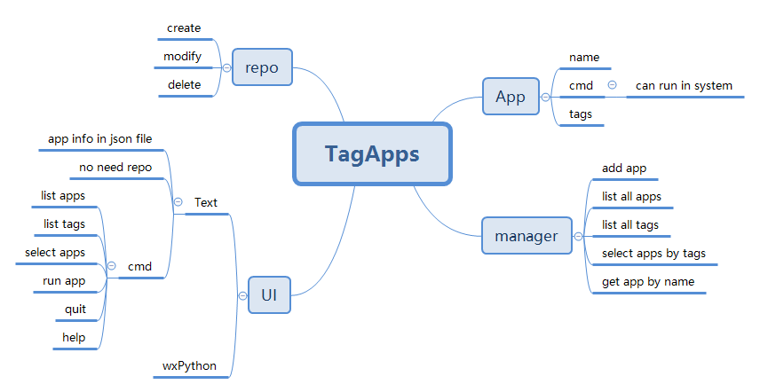

# tagApps
 Manage Apps With Tag

## Text UI Usage
```
Cmd: list(l)                - show all apps
Cmd: tags(t)                - show all tags
Cmd: select(s) tag1,tag2    - select app by tags
Cmd: run(r) app             - start app
Cmd: quit(q)                - quit
Cmd: help(h)                - show this help
```

## App Design
